  <!-- Banner SVG (Save your SVG file as banner.svg in the repository root or .github folder) -->
  

    

  
  
  

  

    <strong>Tactical Code &bull; AI/ML &bull; Battle-Tested Architecture</strong>
  

---
# Hi, I'm Aman! 👋

I'm an AI/ML-focused developer interested in **Machine Learning, Deep Learning, Data Science, and Software Development**.

I enjoy understanding how things work, solving real-world problems, and turning ideas into practical projects. I'm currently strengthening my foundations in **Python, Machine Learning, Deep Learning, Java DSA, SQL, and System Design**.

## 🚀 About Me

- 🤖 Exploring **Artificial Intelligence, Machine Learning & Deep Learning**
- 🐍 Working primarily with **Python**
- ☕ Practicing **Java & Data Structures and Algorithms**
- 📊 Interested in **Data Science, EDA & Data Preprocessing**
- 🧠 Learning **Neural Networks and Deep Learning from scratch**
- 👁️ Exploring **Computer Vision and Object Detection**
- 🗄️ Working with **SQL and MySQL**
- 🏗️ Learning **System Design and production-oriented development**
- 🔬 Interested in taking ML projects from **data → model → evaluation → deployment**
- 💡 Currently focusing on building practical and reliable AI/ML solutions

## 🛠️ Tech Stack

### Languages

### Data & Machine Learning

**Python · Pandas · NumPy · Matplotlib · Scikit-learn · SQL · MySQL**

### Development Tools

